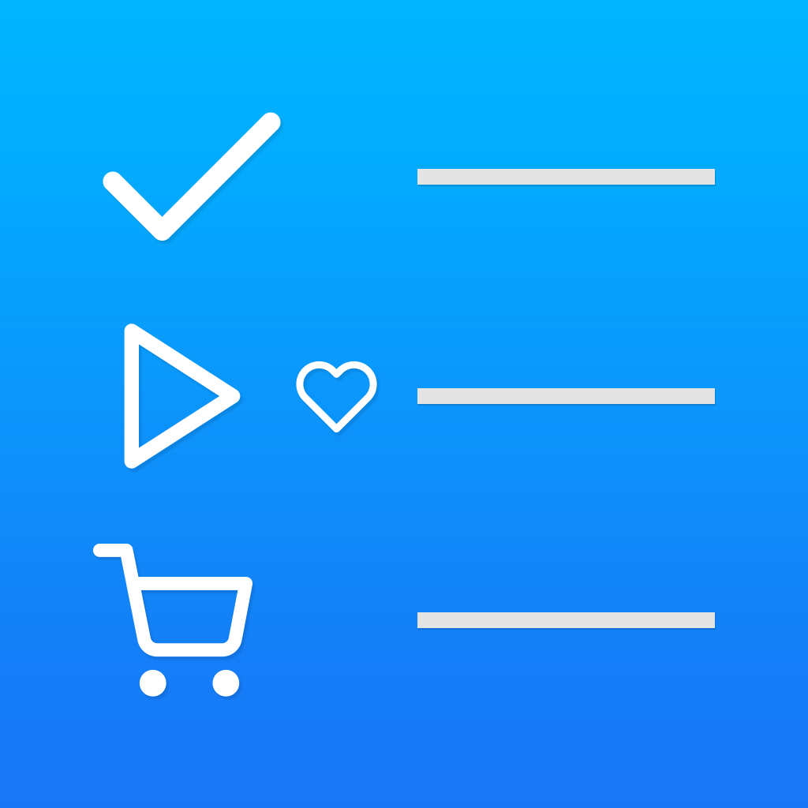

# ToGaming

Games To Do App built on SwiftUI for iOS

* Native SwiftUI
* IGDB API Connection 

## App Icon

  

## Planning

#### Backlog
- [ ] unit/ui tests
- [ ] internationalization for english and portuguese and spanish
- [ ] possibility to integrate with APIs PSN, Xbox, Steam, etc 
- [ ] include game achivements/trophies and game time for individual games 

#### Hard
- [ ] page with graphs/charts for experience ongoing
- [ ] storage data in device (ios storage)
- [ ] store data on icloud + device
- [ ] level ongoing on first startup page
- [ ] include custom pictures for games (on game page)
- [ ] notifications to remind playing games and being kind with user
- [ ] faceid for unlocking app functionality on settings

#### Medium
- [ ] request to IGDB API for games
- [ ] experience points for finished games
- [ ] score points for games played (+metacritic scores if possible)
- [ ] animations for better user experience
- [ ] loader for async calls to apis

#### Easy
- [X] settings page for username, apis keys and secrets for IGDB
- [ ] startup page with recent games bought, to bought, by platforms, favorite games, etc. 
- [ ] Progress bar with level/xp on startup page
- [ ] sheet for adding game that didnt find on search
- [X] status for games (playing, played, to play, to buy)
- [X] searching on first page to view only "my" games
- [ ] swipe on search page to delete recent searched
- [ ] swipe on games search to add to library 
- [X] settings sheet of author of this project

## LICENSE
GPL 3.0
